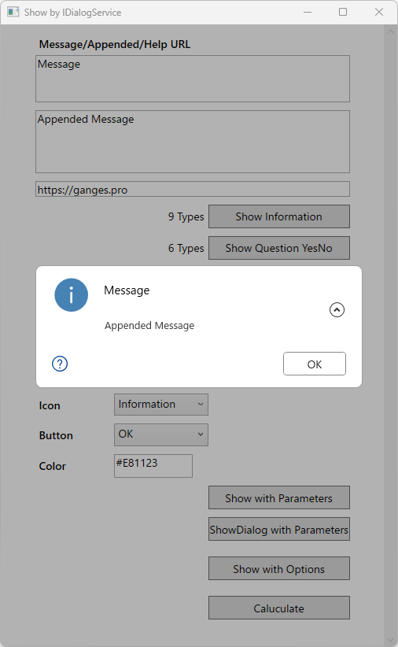

# MessageBoxWPF
Alternative MessageBox for WPF.

## Features
- Show the appended message.
- Show the help button.
- Change the color of the message.
- Show shadow effect.
- Copy the message from the context menu.
- Dim the owner window.
- Support for DI container.
- Show the dialog on Owner's window from Model.

[Screenshots and Japanese manual](https://qiita.com/hiro_t/items/5a2637179d6f580738de/)

## Screenshots

## System Requirements
- .NET 8

## History
- 2024-09-15 Ver 2.0
- 2024-03-22 Ver 1.1
- 2022-02-06 Ver 1.0

## Maintenance
Taisidô@[Ganges](https://ganges.pro/)

## License
Copyright (c) 2022 Taisidô Mikihiro (Ganges)  
Released under the MIT license